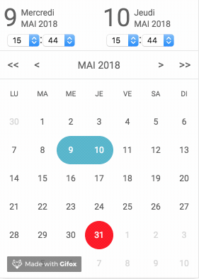
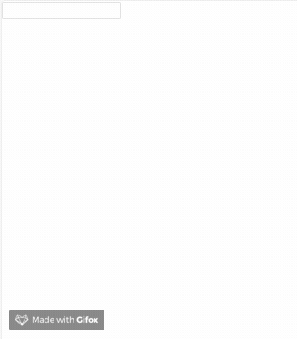

<div align="center">


# @lls/react-light-calendar

🗓 A lightweight calendar for React (~3 kb) [](https://lelivrescolaire.github.io/react-light-calendar/?selectedKind=Calendar&selectedStory=onChange&full=0&addons=1&stories=1&panelRight=0&addonPanel=storybook%2Factions%2Factions-panel)


[](https://bundlephobia.com/result?p=@lls/react-light-calendar@1.0.0)
[](https://badge.fury.io/js/%40lls%2Freact-light-calendar)

</div>

---------------------------------------

`@lls/react-light-calendar` is a **tiny** calendar component which **does NOT depend** on any date lib.
`@lls/react-light-calendar` use **timestamp** format date which allows it to be coupled with any date lib.

<div align="center">



</div>

## Navigation 🗺️ :

- [@lls/react-light-calendar](#llsreact-light-calendar)
  - [Navigation 🗺️ :](#Navigation-️-)
  - [Why 🤔](#Why-)
  - [How to use ✍️](#How-to-use-️)
  - [Demo 👀](#Demo-)
  - [Compatibility ✅](#Compatibility-)
    - [react / react-dom](#react--react-dom)
    - [Browsers 🌍](#Browsers-)
  - [Changelog 🗒️](#Changelog-️)
  - [Examples 📋](#Examples-)
    - [Basic example](#Basic-example)
    - [Good practice example](#Good-practice-example)
    - [Input example](#Input-example)
  - [API 📖](#API-)
    - [startDate](#startDate)
    - [endDate](#endDate)
    - [onChange](#onChange)
    - [disableDates](#disableDates)
    - [displayTime](#displayTime)
    - [dayLabels](#dayLabels)
    - [monthLabels](#monthLabels)
    - [timezone](#timezone)
  - [Development 💻](#Development-)
  - [License 🖋](#License-)

<!-- /TOC -->

## Why 🤔

Because most calendar components depend on **heavy** date library. This make the bundle become **very big** and forces you to use it's **date library dependence**.
This can be a huge problem on big projects that already have had **a lot of dependencies**, especially for projects that use **another date library**.

The purpose of `@lls/react-light-calendar` is to propose a **minimalistic** and **powerful** component to be able to be used on any project.

## How to use ✍️

Install `@lls/react-light-calendar` via npm :

```
npm install --save @lls/react-light-calendar
```

Or via yarn :

```
yarn add @lls/react-light-calendar
```

Use it :

```javascript
import Calendar from '@lls/react-light-calendar'
import '@lls/react-light-calendar/dist/index.css' // Default Style

<Calendar startDate={startDate} onChange={this.onChange} />
```

❗️**Notice the style `import`. If you want to use a custom style, just remove this line and use your own style.**
❗️**Most important elements of `react-light-calendar` have a class, so you can use them to override the current style.**


## Demo 👀

* [Storybook](https://lelivrescolaire.github.io/react-light-calendar/?selectedKind=Calendar&selectedStory=onChange&full=0&addons=1&stories=1&panelRight=0&addonPanel=storybook%2Factions%2Factions-panel)

* [Codesandbox](https://codesandbox.io/s/llsreact-light-calendar-example-cpswp)

## Compatibility ✅

### react / react-dom

`@lls/react-light-calendar` has [react](https://github.com/facebook/react) and [react-dom](https://www.npmjs.com/package/react-dom) as peer dependencies.


| @lls/react-light-calendar | react / react-dom |
|:------------------------- |:------------------|
| 2.x                       | >= 16.3.0         |
| 1.x                       | >= 16.3.0         |

---------------------------------------

### Browsers 🌍

* 🌍Chrome 42+
* 🦊Firefox 37+
* 🧭 Safari 8+
* 🐌Internet Explorer 10+
* 🌍Microsoft Edge

*According to [BrowseEmAll](https://www.browseemall.com/Compatibility/ValidateCSS).*

---------------------------------------

## Changelog 🗒️

* `2.0.6` : Fix month/year navigation (https://github.com/lelivrescolaire/react-light-calendar/issues/6)

---------------------------------------

## Examples 📋

### Basic example

```javascript
import ReactLightCalendar from '@lls/react-light-calendar'
import '@lls/react-light-calendar/dist/index.css'

const DAY_LABELS = ['Lundi', 'Mardi', 'Mercredi', 'Jeudi', 'Vendredi', 'Samedi', 'Dimanche']
const MONTH_LABELS = ['Janvier', 'Fevrier', 'Mars', 'Avril', 'Mai', 'Juin', 'Juillet', 'Aûot', 'Septembre', 'Octobre', 'Novembre', 'Décembre']

class Calendar extends Component {
  constructor(props) {
    super(props)
    const date = new Date()
    const startDate = date.getTime()
    this.state = {
      startDate, // Today
      endDate: new Date(startDate).setDate(date.getDate() + 6) // Today + 6 days
    }
  }

  onChange = (startDate, endDate) => this.setState({ startDate, endDate })

  render = () => {
    const { startDate, endDate } = this.state

    return (
        <ReactLightCalendar startDate={startDate} endDate={endDate} onChange={this.onChange} range displayTime />
    )
  }
}
```

### Good practice example

The best way to avoid massive code and code duplication is to create a `Calendar` composant based on `react-light-component` and use it where you want.

A fully example is available [here](./examples/GOODPRACTICE.md).

---------------------------------------

### Input example

`react-light-component` is delivered with only one component : a calendar.
If you want to use it like a datetime input, you can follow this [examples](./example/INPUT.md).



---------------------------------------

## API 📖

The following list represent all available `@lls/react-light-calendar`'s props.

### startDate
* Type : *Int* (timestamp)
* Default value : *null*
* Required : *false*
* Available since : *v1.0.0*

Default date (timestamp) selected or first date selected if [endDate](#endDate-) is defined.

---------------------------------------

### endDate
* Type : *Int* (timestamp)
* Default value : *null*
* Required : *false*
* Available since : *v1.0.0*

Last date selected.

---------------------------------------

### onChange
* Type : *Function(startDate [Int], endDate [Int])*
* Default value : *empty function*
* Required : *false*
* Available since : *v1.0.0*

This function is called every time a day is selected/updated.

---------------------------------------

### disableDates
* Type : *Function(date [Int])*
* Default value : *empty function*
* Required : *false*
* Available since : *v1.0.0*

This function describe wich days must be disabled (when disabled, a day can't be selected).

Example, disabled all passed day :

```javascript
<Calendar disableDates={date => date < new Date().getTime()} />
```

---------------------------------------

### displayTime
* Type : *Boolean*
* Default value : *false*
* Required : *false*
* Available since : *v1.0.0*

If time input must be displayed.

---------------------------------------

### dayLabels
* Type : *Array[String]*
* Default value : `['Monday', 'Tuesday', 'Wednesday', 'Thursday', 'Friday', 'Saturday', 'Sunday']`
* Required : *false*
* Available since : *v1.0.0*

Days name, starting with Monday.

---------------------------------------

### monthLabels
* Type : *Array[String]*
* Default value : `['January', 'February', 'March', 'April', 'May', 'June', 'July', 'August', 'September', 'October', 'November', 'December']`
* Required : *false*
* Available since : *v1.0.0*

Months name, starting with January.

---------------------------------------

### timezone
* Type : *String*
* Default value : `UTC`
* Required : *false*
* Available since : *v1.0.0*

Calendar timezone.

---------------------------------------

### markedDays
* Type : *Function(date [Int])* or *Array[Number]*
* Default value : *empty function*
* Required : *false*
* Available since : *v2.1.0*

This prop marks the date with the dot below. It can be a function like in `disableDates`. This is useful when you want to mark the days with the events.

Example, mark all passed day :

```javascript
<Calendar markedDays={date => date < new Date().getTime()} />
```

mark today and tomorrow :

```javascript
const today = new Date().getTime()
const tmr = today + (24*60*60*1000)

...

<Calendar markedDays={[today, tmr]} />
```

---------------------------------------

## Development 💻

```
// Clone the project
git clone git@github.com:lelivrescolaire/react-light-calendar.git

// ⬇️ Install node modules
npm install

// 🚀 Start the project
npm run start

// ✅ Run tests
npm run test

// 🏗️ Build the project
npm run build

// 👀 Keep an eye on the bundle size
npm run size
```

---------------------------------------

## License 🖋

[MIT](https://en.wikipedia.org/wiki/MIT_License)


<div align="center">
Developped with ❤️ by
<br />
<br />
<a href='https://www.lelivrescolaire.fr/'></a>
</div>
