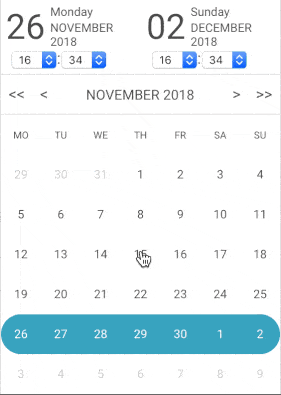

# @lls/react-light-calendar

🗓 A lightweight calendar for React (~4 kb)


---------------------------------------

`@lls/react-light-calendar` is a **tiny** calendar component which **does not depend** on any date lib.
`@lls/react-light-calendar` use **timestamp** format date which allows it to be coupled with any date lib.



## Navigation 🗺️ :

* 🤔 [Why](#why--)
* ✍️ [How to use](#how-to-use--)
* 👀 [Demo](#demo--)
* ✅ [Compatibility](#compatibility--)
	* [react / react-dom](#react--react-dom-)
	* [Browsers](#broswers-)
* 📖 [API](#api--)
	* [startDate](#startdate-)
	* [endDate](#enddate-)
	* [range](#enddate-)
	* [onChange](#onchange-)
	* [disableDates](#disabledates-)
	* [displayTime](#displaytime-)
	* [dayLabels](#daylabels-)
	* [monthLabels](#monthlabels-)
* 📋 [Examples](#examples--)
	* [Basic example](#basic-example-)
	* [Good practice example](#good-practice-example-)
	* [Input example](#input-example-)
* 💻 [Development](#development--)
* 🖋 [License](#license--)

## Why 🤔 :

Because most calendar components depend on **heavy** date library. This make the bundle become **very heavy** and if forces you to his **date library dependence**.
This can be a hug problem on big projects that already have had **a lot of dependencies**, especially for projects that use **another date library**.

The purpose of `@lls/react-light-calendar` is to propose a **pretty minimal** and **powerful** component to be able to be used on any project.

## How to use ✍️ :

Install `@lls/react-light-calendar` via npm :

```
npm install --save @lls/react-light-calendar
```

Or via yarn :

```
yarn add @lls/react-light-calendar
```

Use it :

```javascript
import Calendar from '@lls/react-light-calendar'
import '@lls/react-light-calendar/dist/index.css' // Default Style

<Calendar startDate={startDate} onChange={this.onChange} />
```

❗️Notice the style `import`. If you want to use a custom style, just remove this line and use your own style.


## Demo 👀 :

A [storybook](https://github.com/storybooks/storybook) demo is avaliable [here](https://lelivrescolaire.github.io/react-light-calendar).

## Compatibility ✅ :

### react / react-dom :

`@lls/react-light-calendar` has [react](https://github.com/facebook/react) and [react-dom](https://www.npmjs.com/package/react-dom) as peer dependencies.


| @lls/react-light-calendar | react / react-dom |
|:------------------------- |:------------------|
| 1.x                       | <= 15.6.2         |
| 2.x                       | >= 16.0.0         |

---------------------------------------

### Browsers :

According to [BrowseEmAll](https://www.browseemall.com/Compatibility/ValidateCSS).

| Chrome 42 | Firefox 37 | Safari 8 | Internet Explorer 10 | Microsoft Edge |
|:--------- |:-----------|:---------|:---------------------|:---------------|
| ✅        | ✅        | ✅       | ✅                   | ✅             |

## API 📖 :

The following list represent all avaliable `@lls/react-light-calendar`'s props.

### startDate :
* Type : *Int*
* Default value : *null*
* Required : *false*
* Avaliable since : *v1.0.0*

Default date (timestamp) selected or first date selected if [range](#range-) is `true`.

---------------------------------------

### endDate :
* Type : *Int*
* Default value : *null*
* Required : *false*
* Avaliable since : *v1.0.0*

Last date selected. [range](#range-) must be `true`.

---------------------------------------

### range :
* Type : *Boolean*
* Default value : *false*
* Required : *false*
* Avaliable since : *v1.0.0*

If range selection is enabled.

---------------------------------------

### onChange :
* Type : *Function(startDate [Int], endDate [Int])*
* Default value : *empty function*
* Required : *false*
* Avaliable since : *v1.0.0*

This function is called every time a day is selected/updated.

---------------------------------------

### disableDates :
* Type : *Function(date [Int])*
* Default value : *empty function*
* Required : *false*
* Avaliable since : *v1.0.0*

This function discribe wich days must be disabled (when disabled, day can't be selected).

Example, disabled all passed day :

```javascript
<Calendar disableDates={date => date < new Date().getTime()} />
```

---------------------------------------

### displayTime :
* Type : *Boolean*
* Default value : *false*
* Required : *false*
* Avaliable since : *v1.0.0*

If time input must be displayed.

---------------------------------------

### dayLabels :
* Type : *Array[String]*
* Default value : `['Monday', 'Tuesday', 'Wednesday', 'Thursday', 'Friday', 'Saturday', 'Sunday']`
* Required : *true*
* Avaliable since : *v1.0.0*

Days name.

---------------------------------------

### monthLabels :
* Type : *Array[String]*
* Default value : `['January', 'February', 'March', 'April', 'May', 'June', 'July', 'August', 'September', 'October', 'November', 'December']`
* Required : *true*
* Avaliable since : *v1.0.0*

Months name.

## Examples 📋 :

### Basic example :

```javascript
import ReactLightCalendar from '@lls/react-light-calendar'
import '@lls/react-light-calendar/dist/index.css'

const DAY_LABELS = ['Lundi', 'Mardi', 'Mercredi', 'Jeudi', 'Vendredi', 'Samedi', 'Dimanche']
const MONTH_LABELS = ['Janvier', 'Fevrier', 'Mars', 'Avril', 'Mai', 'Juin', 'Juillet', 'Aûot', 'Septembre', 'Octobre', 'Novembre', 'Décembre']

class Calendar extends Component {
  constructor(props) {
    super(props)
    const date = new Date()
    const startDate = date.getTime()
    this.state = {
      startDate, // Today
      endDate: new Date(startDate).setDate(date.getDate() + 6) // Today + 6 days
    }
  }

  onChange = (startDate, endDate) => this.setState({ startDate, endDate })

  render = () => {
    const { startDate, endDate } = this.state

    return (
        <ReactLightCalendar startDate={startDate} endDate={endDate} onChange={this.onChange} range displayTime />
    )
  }
}
```

---------------------------------------

### Good practice example :

The best way to avoid massive code and code duolication is to create a `Calendar` composant based on `react-light-component` and use it where you want.

A fully example is avaliable [here](./example/GOODPRACTICE.md).

---------------------------------------

### Input example :

`react-light-component` is delivred with only on component : a calendar.
If you want to use it like a datetime input, you can follow this [example](./example/INPUT.md).


## Development 💻 :

```
// Clone the project
git clone git@github.com:lelivrescolaire/react-light-calendar.git

// ⬇️ Install node modules
npm install

// 🚀 Start the project
npm run start

// ✅ Run tests
npm run test

// 🏗️ Build the project
npm run build

// 👀 Keep an eye on the bundle size
npm run size
```

## License 🖋 :

[MIT](https://en.wikipedia.org/wiki/MIT_License)

---------------------------------------

<center>
Developped by


</center>
